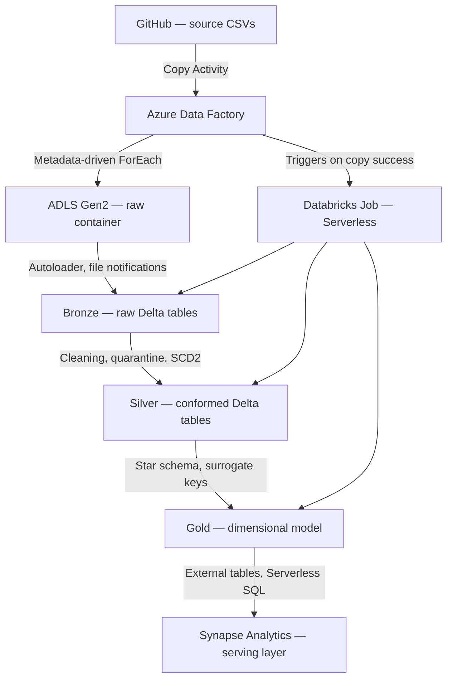
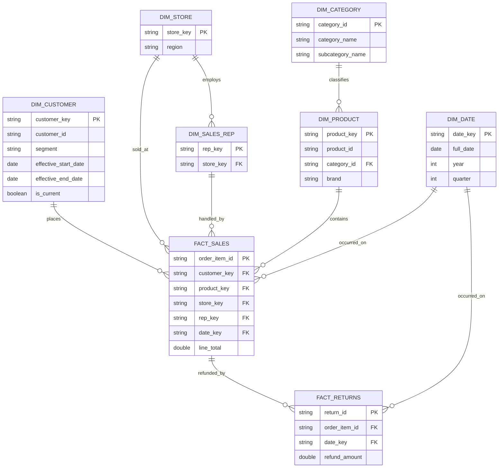
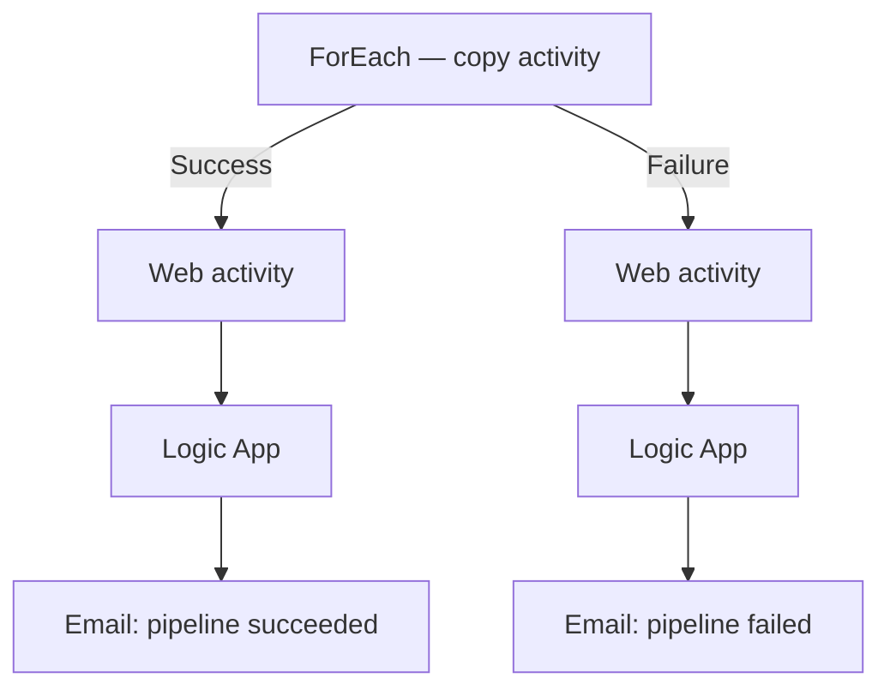
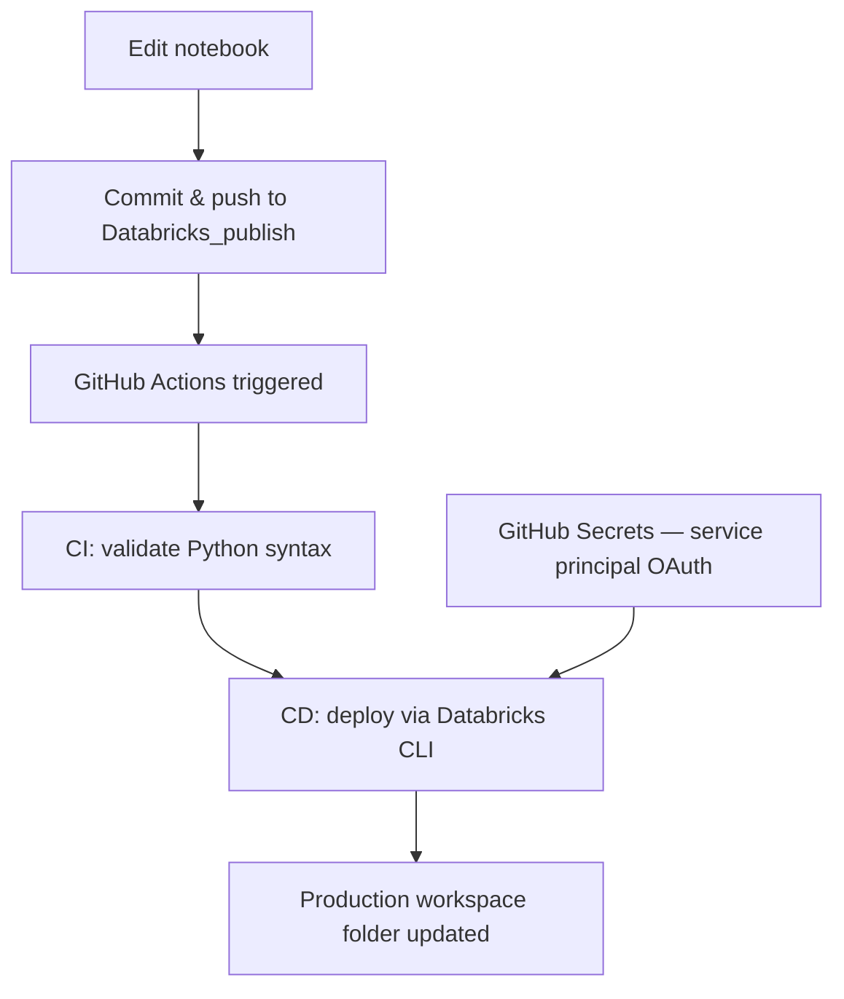

# Azure Sales Data Pipeline

An end-to-end, production-pattern data engineering pipeline for a retail sales analytics domain — built on Azure Data Factory, Azure Data Lake Storage Gen2, Databricks (Unity Catalog, Autoloader, Structured Streaming, Delta Lake), and Azure Synapse Analytics, with automated CI/CD via GitHub Actions.

This project implements a full **medallion architecture** (raw → bronze → silver → gold) with metadata-driven ingestion, SCD Type 2 dimensional history, a star-with-snowflake gold schema, and a fully automated, orchestrated daily pipeline — from source file drop to BI-ready serving layer, with zero manual intervention.

---

## Architecture overview

ADF orchestrates the pipeline end to end: it copies new source files into raw storage, then triggers a single Databricks Job (four dependent Serverless tasks: bronze → silver → gold → reporting) on a daily schedule. Synapse's external tables query the gold Delta files live — no data duplication, no separate refresh needed.

---

## Repository structure

This project spans multiple Azure services, each with its own Git integration and deployment branch — mirroring how a real multi-service Azure project is actually organized, rather than forcing everything into one branch:

| Branch | Owner | Contents |
|---|---|---|
| [`main`](../../tree/main) | Azure Data Factory | Pipeline definitions, linked services, datasets, integration runtimes, and the source data repository (`/data`) |
| [`Databricks_publish`](../../tree/Databricks_publish) | Databricks | Bronze/silver/gold notebooks (`/lakehouse`) and the GitHub Actions CI/CD workflow that auto-deploys them |
| [`synapse_publish`](../../tree/synapse_publish) | Synapse Analytics | Compiled ARM deployment artifacts for the Synapse workspace |
| [`ADF-publish`](../../tree/ADF-publish) | Azure Data Factory | ADF's compiled ARM publish branch |

Each branch reflects that specific tool's own Git-native publish target. This is deliberate, not accidental — merging them would create folder collisions and would blur the boundary between independently-managed deployment artifacts.

---

## Data domain

Synthetic sales analytics data for a mid-size retail company, modeling a real source system's daily export pattern:

**Dimensions:** `customers`, `products` (with `category`/`subcategory`), `stores`, `sales_reps`
**Facts:** `sales_orders`, `order_items`, `returns`

Source files simulate real-world messiness deliberately: duplicate rows, blank foreign keys, inconsistent date formats, invalid quantities, orphaned references, and inconsistent text casing — so the silver-layer cleaning logic has genuine problems to solve, not just formality.

---

## Medallion architecture

### Raw
Immutable landing zone in ADLS Gen2, partitioned by entity. Populated by an ADF pipeline driven by a **metadata-driven control table** (a JSON array read via a Lookup activity, iterated by a ForEach + parameterized Copy Activity) — adding a new source file means adding one row to the config, not building a new pipeline.

### Bronze
Ingested via **Databricks Autoloader** in **file notification mode** (Unity Catalog managed file events — Event Grid + Storage Queue under the hood, not directory listing), using `trigger(availableNow=True)` for scheduled batch-style incremental processing. One Autoloader stream per source folder, each with its own checkpoint. Raw data is preserved as-is, tagged with `_source_file`, `_ingested_at`, and `_entity` for full lineage; Autoloader's built-in `_rescued_data` column captures any malformed rows without breaking the pipeline.

### Silver
Cleaning, conforming, and business-rule logic, implemented via `foreachBatch` + `MERGE`:
- **Fact tables** (`sales_orders`, `order_items`, `returns`): deduplication, ANSI-safe date parsing (`try_to_date`), status normalization, null handling. `order_items` additionally runs a **referential-integrity check** against `sales_orders` and **quarantines** rows with invalid quantities or orphaned foreign keys into a parallel table, rather than silently dropping or guessing at fixes.
- **Dimension tables** (`customers`, `products`, `stores`, `sales_reps`): full **SCD Type 2** history via a generalized, reusable merge function (`make_scd2_merger`) — hash-based change detection, `effective_start_date`/`effective_end_date`/`is_current` versioning, and a two-step MERGE pattern (close changed rows, then insert new versions).

### Gold
A **hybrid star/snowflake schema** — `dim_product` is deliberately snowflaked into `dim_category` to demonstrate normalization trade-offs, while the rest of the model stays flat for query simplicity. Every dimension carries a **deterministic, hash-based surrogate key** (`sha2` of business key + version start date) rather than `monotonically_increasing_id()`, ensuring keys stay stable across reprocessing. Fact tables resolve historically-correct dimension keys via **range joins** against each SCD2 dimension's effective-date window — a sale from six months ago correctly joins to the customer's address *as it was at the time*, not their current address.

### Serving — Synapse Analytics
Gold Delta tables are exposed via **Synapse Serverless SQL Pool external tables** — a live, query-in-place layer with zero data duplication and zero refresh scheduling required (external tables always reflect the current state of the underlying Delta files). Authentication uses a database-scoped credential bound to the Synapse workspace's managed identity, rather than Azure AD pass-through, ensuring consistent, governed access regardless of who queries it.

---

## Orchestration & automation

- **ADF** runs on a scheduled trigger (`ScheduleTrigger`, 24-hour recurrence), copying new source files into raw via a metadata-driven ForEach/Copy pipeline.
- On successful copy, ADF triggers a single **Databricks Job** (`Daily_Sales_Pipeline`) running on **Serverless compute** — four dependent tasks (`bronze_ingestion` → `silver_processing` → `gold_processing` → `generate_report`), sharing one cluster startup instead of provisioning separate compute per layer.
- **`generate_report`** runs last, after gold completes successfully. It queries row counts across every bronze, silver, and gold table, checks `fact_sales` for any unresolved foreign keys (a broken range join would surface here), and reports how many rows sit in the `order_items` quarantine table — giving a data-quality snapshot of the run, not just a pass/fail signal.
- **Deliberate design choice:** dimension/table DDL and one-time setup logic (schema creation, static reference data like `dim_date`) live in separate `*_one_time_job` notebooks, run once, never scheduled — keeping the daily recurring notebooks focused purely on incremental processing logic.

---

## Monitoring & notifications

The ADF pipeline branches on the outcome of its copy activity into two `Web` activities, wired in parallel with the Databricks Job trigger off the same `ForEach` success/failure output:

Each `Web` activity calls an HTTP-triggered **Azure Logic App**, which formats and sends an email notification — a success confirmation, or a failure alert — so pipeline outcomes are visible without anyone needing to actively check ADF's monitoring UI. This runs independently of, and in parallel with, the Databricks Job trigger, so a notification is sent regardless of whether the downstream medallion processing itself succeeds or fails.

**Databricks-side notifications** complement this with layer-level granularity: each of the four tasks in `Daily_Sales_Pipeline` (`bronze_ingestion`, `silver_processing`, `gold_processing`, `generate_report`) has its own **on-failure** email alert, so a break in any single layer — including the reporting step itself — is immediately identifiable without opening the run details. The job as a whole sends one **on-success** confirmation once all four tasks have completed cleanly. This avoids alert fatigue from redundant per-task success emails while still pinpointing exactly which stage failed if something breaks. A `generate_report` failure specifically means the pipeline's data completed successfully but the reporting step itself broke — a meaningfully different situation from a `bronze`/`silver`/`gold` failure, worth distinguishing when triaging an alert.

---

## CI/CD

- A **Databricks-managed service principal**, scoped to least-privilege (workspace access only — no cluster creation, no admin rights), authenticates via OAuth client credentials stored as encrypted GitHub Secrets.
- CI (notebook syntax validation) gates CD (deployment) — a broken commit never reaches the workspace.
- Deployment targets a **dedicated, hands-off production folder** (`/Workspace/CD_Production_SalesPipeline`), kept separate from the interactive development folder, so an automated deploy can never silently overwrite in-progress manual edits.
- The scheduled Databricks Job reads exclusively from this CD-deployed folder — the live pipeline always reflects the last commit pushed to `Databricks_publish`, not whatever happens to be open in a notebook at the time.

---

## Key engineering decisions & lessons

- **Metadata-driven pipelines over hardcoded activities** — a single parameterized ADF Copy Activity and a single generic Databricks ingestion/merge function, each driven by a config array, rather than one pipeline/notebook per entity.
- **Bronze organized by entity, not by extract type** — full snapshots and CDC-style deltas for the same entity land in the same bronze table, resolved by a window-function "latest per key" step before any SCD2 merge, so the pipeline handles both patterns without branching logic.
- **Quarantine over silent drop or guess** — referential-integrity and business-rule violations are routed to a parallel table with a reason code, not discarded or auto-corrected.
- **Deterministic surrogate keys** — hash-based, not `monotonically_increasing_id()`-based, so re-running a merge never reassigns a different key to the same logical row.
- **SCD2 `effective_start_date` must come from real business time, not ingestion time** — a genuine bug hit mid-build: dimensions without a real source "changed at" column defaulted to `_ingested_at`, which broke historical range joins the moment fact data with earlier real-world dates was involved. Fixed by sourcing the date from each entity's actual business column (`created_at`, `opened_date`, `hire_date`) instead.
- **ADF's Databricks Notebook activity does not support Serverless compute** — only Databricks Jobs support it natively at the task level. Solved by consolidating three separate ADF-triggered notebook activities (three cold starts) into one Databricks Job with three dependent Serverless tasks, triggered by ADF as a single unit.
- **Unity Catalog managed tables have no human-readable physical path** — cross-tool integration (Synapse external tables) required resolving each table's real UUID-based storage location via `DESCRIBE DETAIL`, since Synapse has no awareness of Unity Catalog's logical naming.

---

## Future improvements

- **Persist `generate_report`'s output** to a Delta table (`gold.pipeline_run_reports`) rather than only surfacing it in the run's console output, giving queryable history across every past run instead of having to open individual job runs to see past results.
- **Environment separation** (dev/staging/prod) with GitHub Actions environment protection rules or Azure DevOps Pipeline approval gates, rather than a single production deployment target.
- **Databricks Asset Bundles** for fully declarative job/infrastructure definitions, as an alternative to the current notebook-based CI/CD deployment.

---

## Tech stack

`Azure Data Factory` · `Azure Data Lake Storage Gen2` · `Databricks (Unity Catalog, Autoloader, Structured Streaming, Delta Lake)` · `Azure Synapse Analytics (Serverless SQL Pool)` · `GitHub Actions` · `PySpark` · `Spark SQL` · `T-SQL`
